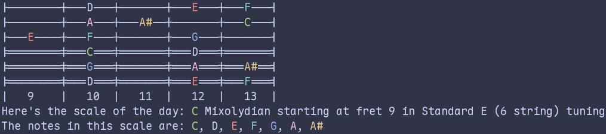

# Daily Scale

Welcome to Daily Scale! This is a simple program that will help you practice a new scale every day.

## Installation

You can install `daily-scale` directly from crates.io using cargo:

```sh
cargo install daily-scale
```

## Basic Usage

When executed without any options, the program will randomly select a root note, a scale and a starting fret. (The randomness is seeded by the current date so you have all day to work on it.) Here's an example of the output:



<details><summary>Uncolored version (if your terminal doesn't support colors)</summary>

    |---A#---|--------|---C----|--------|---D---|
    |---F----|--------|---G----|--------|---A---|
    |--------|---D----|---D#---|--------|---F---|
    |========|===A====|===A#===|========|===C===|
    |===D#===|========|===F====|========|===G===|
    |===A#===|========|===C====|========|===D===|
    |   6    |   7    |   8    |   9    |   10  |
    Here's the scale of the day: D Phrygian starting at fret 6 in Standard E (6 string) tuning
    The notes in this scale are: D, D#, F, G, A, A#, C

</details>

## Command-line Options

```
Usage: daily-scale [OPTIONS]

Options:
-t, --tuning <TUNING>
        Select the tuning you want to play in [default: standard-e6] [possible values: standard-e6, open-g6, open-e6, open-d6, open-c6, open-a6, drop-d6, standard-d6, drop-c-sharp6, standard-c-sharp6, drop-c6, standard-c6, standard-b7, drop-a7, standard-a7, all-fourths7]
-s, --scales <SCALES>
        Provide a comma separated list of scales [possible values: major, harmonic-minor, melodic-minor, natural-minor, pentatonic-major, pentatonic-minor, pentatonic-blues, pentatonic-neutral, whole-diminished, half-diminished, ionian, dorian, phrygian, lydian, mixolydian, aeolian, locrian]
-n, --root-notes <ROOT_NOTES>
        Provide a comma separated list of root notes for the scale [possible values: a-flat, a, a-sharp, b-flat, b, c, c-sharp, d-flat, d, d-sharp, e-flat, e, f, f-sharp, g-flat, g, g-sharp]
-f, --starting-frets <STARTING_FRETS>
        Provide a comma separated list of numbers for the starting fret
-r, --full-randomness
        If enabled, the scale generator will use a fully random seed instead of today's date
-c, --uncolored
        If enabled, the output will be in plain text without color
-h, --help
        Print help
-V, --version
        Print version
```

## Available Options

### Tunings

- Standard E (6 string)
- Open G (6 string)
- Open E (6 string)
- Open D (6 string)
- Open C (6 string)
- Open A (6 string)
- Drop D (6 string)
- Standard D (6 string)
- Drop C# (6 string)
- Standard C# (6 string)
- Drop C (6 string)
- Standard C (6 string)
- Standard B (7 string)
- Drop A (7 string)
- Standard A (7 string)
- All fourths (7 string)

### Scales

- Major
- Harmonic Minor
- Melodic Minor
- Natural Minor
- Pentatonic Major
- Pentatonic Minor
- Pentatonic Blues
- Pentatonic Neutral
- Whole Diminished
- Half Diminished
- Ionian
- Dorian
- Phrygian
- Lydian
- Mixolydian
- Aeolian
- Locrian